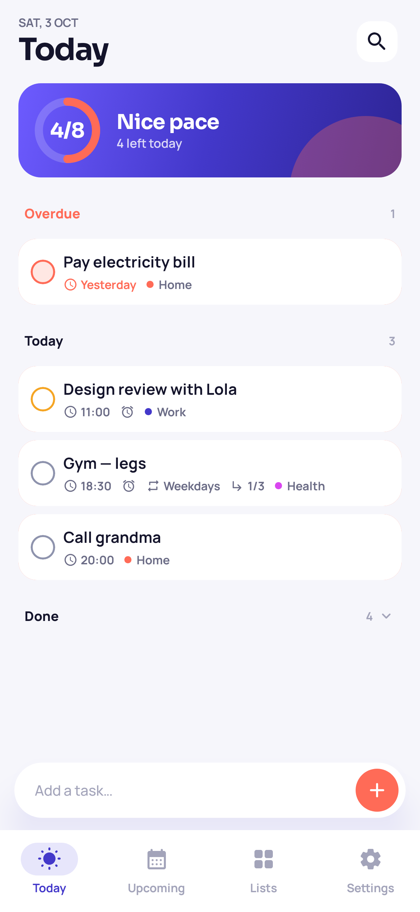
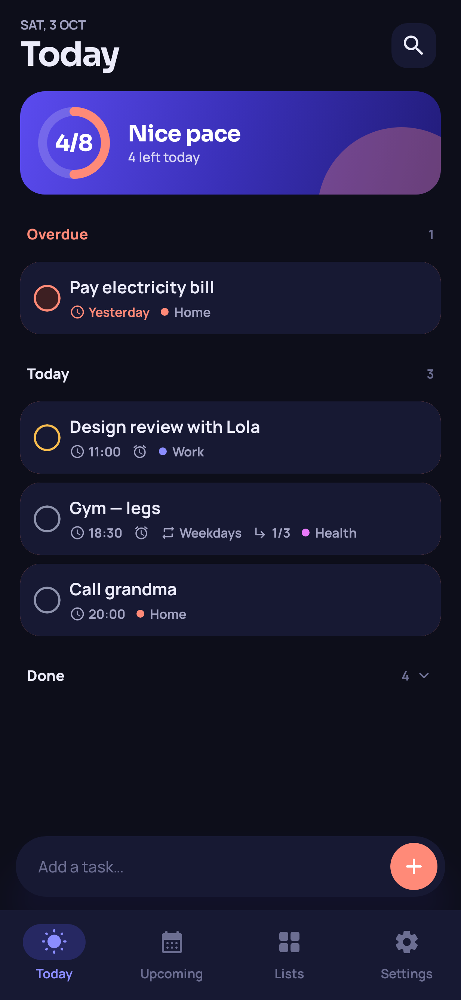
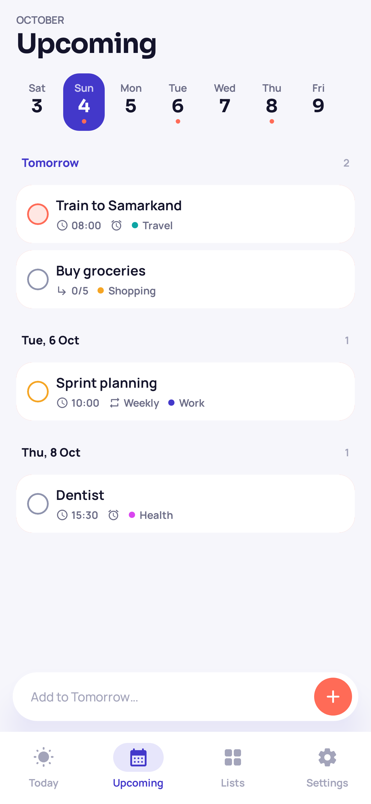
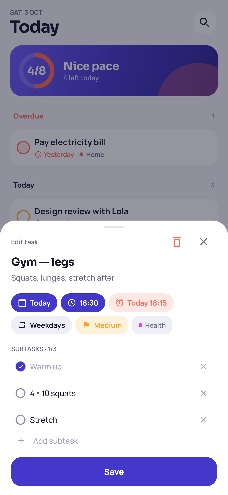
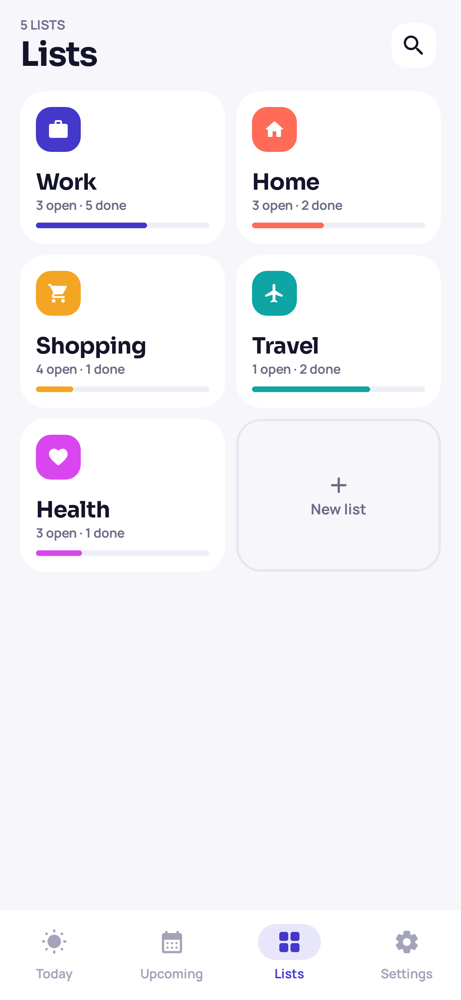
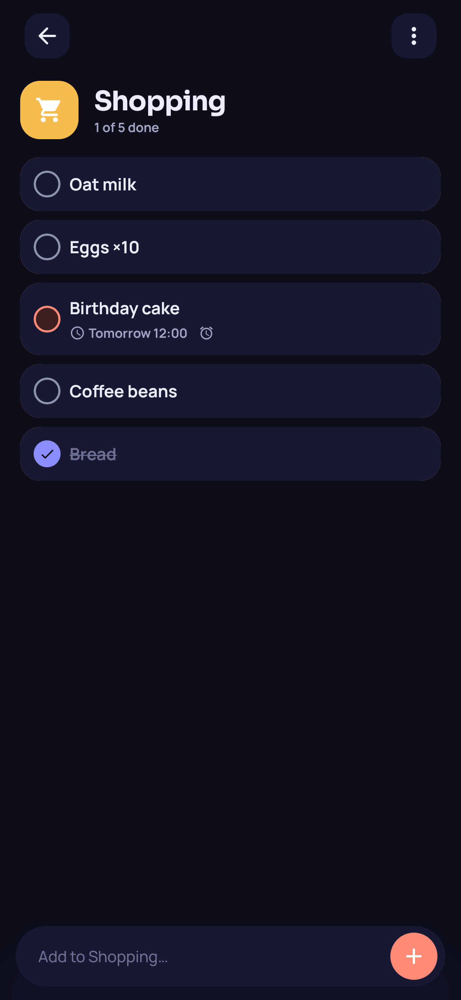
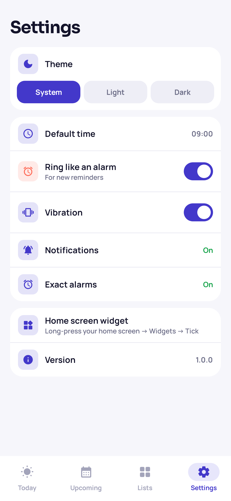
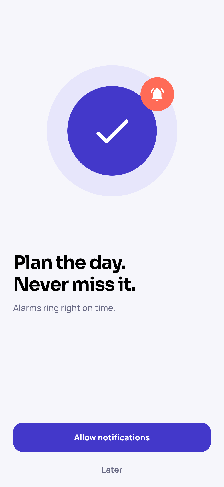

<div align="center">

# Tick

A to-do app that rings like an alarm clock. Plan the day, check things off, never miss the important ones.
Works fully offline, with no account.

[](https://github.com/AdilxanKenesov/ToDoApp/releases/latest)


</div>

## Screenshots

| Today | Today · dark | Upcoming |
|:---:|:---:|:---:|
|  |  |  |
| **Task editor** | **Lists** | **List · dark** |
|  |  |  |
| **Settings** | **Welcome** | |
|  |  | |

## Features

- **Today**:
  - a progress ring
  - Overdue / Today / Done sections
  - the date rolls over by itself at midnight
- **Upcoming**: a two-week strip and tasks grouped by day.
- **Lists**: colors, icons and progress for each list.
- **Quick add**: type `Call mom tomorrow 18:00 !high #Home` and press Enter. Date, time, priority, list and the reminder are filled in for you.
- **Task details**:
  - notes and subtasks
  - due date and time
  - priority (Low / Medium / High)
  - list
- **Alarms**:
  - **Ring like an alarm**: alarm sound that keeps ringing until you react, and the alarm icon in the status bar.
  - **Quiet reminder**: a normal notification.
  - Both have **Done** and **Snooze 10 min** buttons in the notification.
- **Repeat**: once, daily, weekdays, weekly or monthly.
  - Completing a repeating task moves it to its next date.
  - Its alarm keeps ringing on schedule.
- **Reliable**: reminders come back after a reboot or a time zone change. A reminder that was due while the phone was off rings once when it starts.
- **Swipe**: right to complete, left to delete, with **Undo**.
- **Search** across titles and notes.
- **Home-screen widget**: today's tasks, tap to complete, `+` to add.
- **Theme**: System, Light or Dark.

## Download

Get the latest APK from [**Releases**](https://github.com/AdilxanKenesov/ToDoApp/releases/latest) and open it on your phone
(allow “Install unknown apps” when Android asks).

On Android 12+ allow **Alarms & reminders** when the app asks, so alarms ring at the exact minute.

## Tech stack

| Area | Library |
|---|---|
| UI | Jetpack Compose, Material 3, Sora & Manrope fonts |
| Architecture | MVI with [Orbit 12](https://orbit-mvi.org) (`OrbitContainerHost`), clean layers |
| Navigation | [Voyager](https://voyager.adriel.cafe): screens, tabs, bottom sheet; a `Channel`-based navigator |
| DI | Hilt (+ hilt-work) |
| Async | Coroutines, `Flow`, `callbackFlow` |
| Storage | Room (tasks, subtasks, lists), SharedPreferences (settings) |
| Alarms | `AlarmManager` (`setAlarmClock` / exact alarms), BroadcastReceivers, notifications |
| Background | WorkManager (reschedule after boot or clock change) |
| Widget | Jetpack Glance |
| Dates | `java.time` with core library desugaring |

## Architecture

```
presenter  ──►  domain  ◄──  data
(Compose,       (models,      (Room, prefs, AlarmManager,
 ViewModels)     use cases,    receivers, workers, widget)
                 repository
                 interfaces)
```

Every screen has the same four parts:

| File | Role |
|---|---|
| `XContract` | `ViewModel` interface (`OrbitContainerHost<State, State, SideEffect>`), `Intent`, `SideEffect`, `UiState`, `Directions` |
| `XViewModel` | `orbitContainer(UiState()) { onCreate }`; live data in `repeatOnSubscription` |
| `XDirections` | Navigation, injected, so the ViewModel never touches Voyager |
| `XScreen` | Collects state and side effects; draws a stateless `XScreenContent` |

`callbackFlow` wraps three Android callbacks:
- the settings listener (theme switches live)
- a `BroadcastReceiver` for time tick, date, clock and time zone changes, so "Today" stays correct
- the exact-alarm permission broadcast

The reminder lives on the task row itself. Room is the single source of truth, so alarms never drift out of sync.

<details>
<summary>Project structure</summary>

```
app/src/main/java/uz/relay/todoapp
├── app/            TodoApp: Hilt, WorkManager config, notification channels
├── data/
│   ├── local/      Room entities and DAOs, SharedManager
│   ├── reminder/   ReminderScheduler, AlarmReceiver, BootReceiver, RescheduleWorker, NotificationHelper
│   ├── system/     callbackFlow sources for date and permissions
│   └── repository_impl/
├── di/             Hilt modules
├── domain/         models, repository interfaces, use cases (+ impl/)
├── navigation/     AppNavigator, dispatcher, deep links
├── presenter/      splash, onboarding, main (tabs), today, upcoming, lists, listdetail, search, editor, settings
├── ui/             theme and shared components
├── utils/          recurrence, quick-add parser, date labels
└── widget/         Glance "Today" widget
```

</details>

## Build it yourself

**Requirements:** Android Studio with AGP 9, JDK 17.

```bash
./gradlew installDebug
```

### Release build

Signing data is read from `keystore.properties` in the project root. The file is git-ignored.

```properties
storeFile=/absolute/path/to/release.jks
storePassword=…
keyAlias=…
keyPassword=…
```

On CI the same values can come from the environment variables `TICK_KEYSTORE_FILE`, `TICK_KEYSTORE_PASSWORD`, `TICK_KEY_ALIAS` and `TICK_KEY_PASSWORD`.

```bash
./gradlew assembleRelease   # → app/build/outputs/apk/release/app-release.apk
```

### Screenshots

```bash
./gradlew recordRoborazziDebug   # regenerate docs/screenshots/*.png
```

They are rendered from the real Compose screens with demo data (Roborazzi + Robolectric).

## Permissions

| Permission | Why |
|---|---|
| `POST_NOTIFICATIONS` | Show reminders (Android 13+) |
| `SCHEDULE_EXACT_ALARM` | Ring at the exact minute (Android 12+, asked when you set the first reminder) |
| `RECEIVE_BOOT_COMPLETED` | Put alarms back after a restart |
| `VIBRATE` | Vibrate when a reminder rings (can be turned off) |

All data stays on the device.
